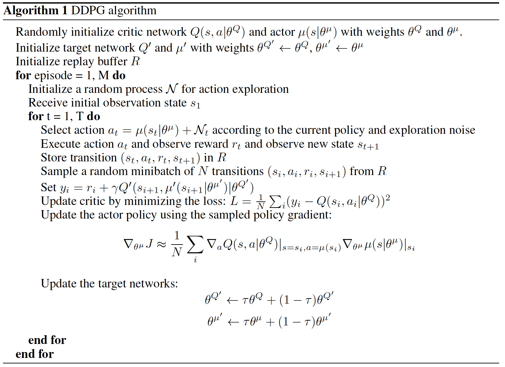

# Project 2: Continuous Control
## Udacity Deep Reinforcement Learning
The purpose of this document is to describe the details of the project; including the algorithm, network architecture, training hyperparameters and results.

A large portion of this project was based on the course work and repository for [DDPG Bipedal](https://github.com/udacity/deep-reinforcement-learning/tree/master/ddpg-bipedal)

--- 
## Project overview 
The goal of this project was to train an agent to control a double-jointed arm such that it would track a ball around. 

As described in the project: *A reward of +0.1 is provided for each step that the agent's hand is in the goal location. Thus, the goal of your agent is to maintain its position at the target location for as many time steps as possible.*

*The observation space consists of 33 variables corresponding to position, rotation, velocity, and angular velocities of the arm. Each action is a vector with four numbers, corresponding to torque applicable to two joints. Every entry in the action vector should be a number between -1 and 1.*

## Learning Algorithm
In this section we briefly describe the learning algorithm, along with the network architectures used in this project.

Reinforcement learning algorithms can be categoized as either **value-based**, **policy-based** or combination of the two. **Value-based** learning consists of learning a state-action value function (*Value/Q-function*) that leads to the **highest-valued state**, by contract the **policy-based** approach tries to directly learn a (optimal) policy function directly (without the intermediary *Value/Q-function*). 

In the previous [assignment](https://github.com/joshnewnham/Udacity_DeepReinforcementLearning_Project1/blob/master/REPORT.md) we used a *value-based* algorithm, [Deep Q-Network (DQN)](https://deepmind.com/research/dqn/), to successfuly train an agent to navigate an environment scattered with *good* and *bad* bananas. DQN has seen much success dealing with environments with high-dimensional (complex) states but only dealing with discrete actions. Unfortunately *value-based* algorithms don't scale well when the action space is large, such as when they require a continous output (as its very difficult to converge for large action spaces) such as what is required in this project.  

**Deep Deterministic Policy Gradient (DDPG)** (the algorithm used in this project) builds on DPG (mentioned above) but introduces an **actor-critic architecture** to deal with a large action space (continous or discrete). 

An **actor** is used to tune the parameters 𝜽 for the policy function i.e. decide the best action for a specific state while a **critic** is used to evaluate the policy function estimated by the actor according to the temporal difference (TD) error (*TD learning is a way to learn how to predict a value depending on future values for a given state, similar to Q-Learning*). 

The figure below illustrates the Actor-critic Architecture (source [Continous Control with Deep Reinforcement Learning](https://arxiv.org/pdf/1509.02971.pdf)).

  

To improve stability, DDPG borrows the ideas of **experience replay** and **fixed Q-targets** from DQN (as explained in the previous [project](https://github.com/joshnewnham/Udacity_DeepReinforcementLearning_Project1/blob/master/REPORT.md)). 

The figures below illustrate the networks used in this project for the **actor** and **critic**. 

One side-effect using a policy-based approach is the tendency to converge at local minima; to mitigate this a noise is added to the action during training to encourage exploration. 

Below is an extract from the paper [Continous Control with Deep Reinforcement Learning](https://arxiv.org/pdf/1509.02971.pdf) showing the pseudo code for DDPG. 

## Training  
In this section we present the results from training; including the hyper parameters and average score for training and inference. 

The following GIF shows an **untrained** agent. 

 

Training (after much experimentation) used the following hyperparameters:
- Replay buffer size **100000** 
- Minibatch size **64**
- Discount factor (gamma) **0.99**
- Soft update interpoloation (TAU) **1e-3**
- Learning rate of the actor **1e-4**
- Learning rate of the critic **1e-4**
- L2 weight decay **0** 
- Number of episodes played **500**
- Max time (number of steps) per episode **1000** 

The following plot shows the score achieved during training; demonstrating the agent was able to meet the 30 point score goal shortly after approximately 200 episodes. 

And now we see the **trained** agent in action (GIF below). 

... and finally a plot of the score of the agent over 500 episodes with a max time of 1000 for each. 

## Ideas for Future Work 
The amount of experimentation that could be performed was somewhat limited by the amount of time is required to perform training; so an obvious first point is further experimentation on the network architecture to find a more optimum actor and critic architecture. Some other thoughts include: 
- Introduce a decay to the noise added to the action to improve stability. 
- Use a priority algorithm for sampling from the replay buffer instead of uniformly sampling
- Use recurrent networks to capture temporal details of the environment.

